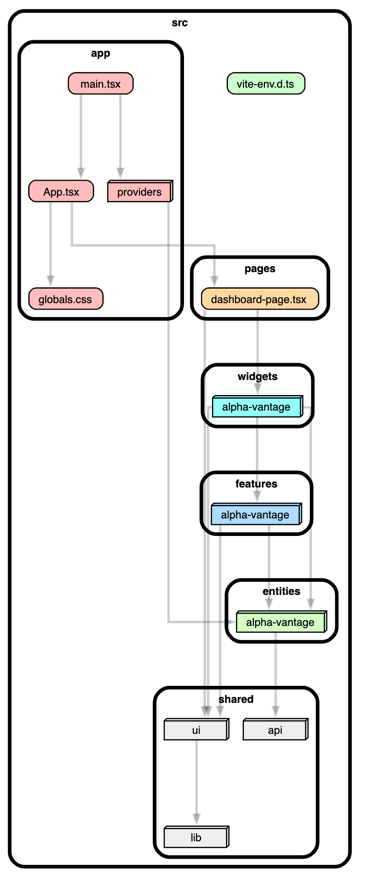

# Test task

## How to run
`pnpm i && pnpm dev`

also available here - 

## Stack (and reasons)
- UI framework: React (one of 3 industry standards, less opinionated, more flexible, great community, good support, fast)
- State management: RTK + Query (analog of React query which is provided by redux under the hood, so we don't need to mix technologies)
- Forms: React Hook Form (analog of Formik, natively supported by our ui framework - shadcn ui)
- Charts: react-chartjs-2 (analog of recharts, was selected as matter of experience)
- Build tool: Vite (faster and more simple than webpack, perfect for small projects, has some limitations on scale, for example support for module federation is not good (plugin vite module federation seems abandoned by maintainers) so can be bad for big projects)
- Formatter: Prettier (industry standard, good note that we should use it without eslint, because eslint is much slower as a formatter, so eslint only for linting)
- Linting: ESLint, commitlint
- Type checking: TypeScript
- Architecture visualization: dependency-cruiser
- UI library: Tailwind CSS + Shadcn UI
- Package manager: pnpm (better back compatibility, faster installs, benchmarks - https://pnpm.io/benchmarks)

## Good practices which are used in this project

- Architecture methodology: Feature Sliced Design https://feature-sliced.design/ (Help us to keep codebase scalable and maintainable)
- Client side caching with RTK Query: to reduce number of requests to backend
- Pre commit hooks: to keep codebase consistent and git history clean
- Linter for commits: to keep same convention in repo (git conventional commits)
- Component dependency visualization: to manage architecture (we can see that every layer has alpha-vantage folder, this helps to keep FSD structure extensible for new big business entities) 
- Path aliases: to make imports more readable and maintainable
- Environment variables: to keep secrets out of codebase

## What should be done when have time

- [!] Replace .env.development with .evn and don't track it in git
- Add unit tests (good oop model for testing which allows not to hardcode selectors)
- e2e with playwright or cypress (cover main user scenarios)
- proper ci pipeline (units, e2e, linting, type checking, formatting) and automatic deploys to dev and prod environments 
- Form refactoring (currently we have a bit of duplication in form components, we should refactor it)
- Check Todos in the code
- Proper error handling with sentry and error boundaries
- Lazy loading of components
